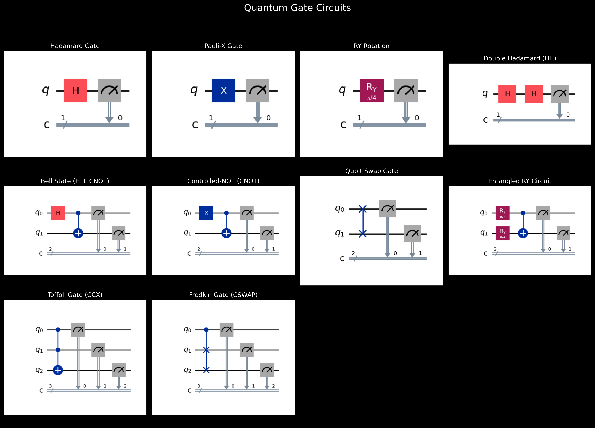
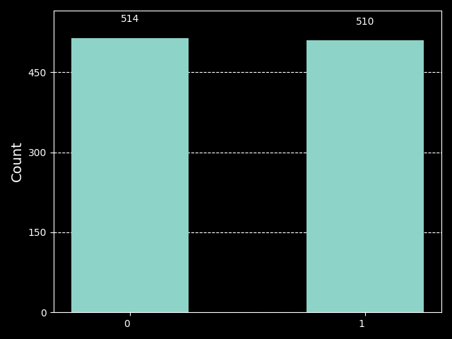

# AI Quantum Computing Agent

This project demonstrates an **AI-powered agent** that interprets natural language prompts, decides on quantum operations using an LLM (OpenAI GPT), and executes quantum circuits with Qiskit. The agent visualizes results as circuit diagrams, measurement histograms, and Bloch sphere representations.

## Features

- Natural language interface for quantum circuit tasks
- Integration with OpenAI GPT (via LangChain/LangGraph)
- Quantum circuit execution and simulation (Qiskit + Qiskit Aer)
- Automatic visualization: circuit diagram, histogram, Bloch sphere

## How It Works

1. **Prompt:** You provide a natural language instruction (e.g., "Apply a Hadamard gate", "Apply an X gate to the qubit", or "Create a Bell state with two qubits").
2. **AI Reasoning:** The agent uses OpenAI GPT to interpret the instruction.
3. **Quantum Execution:** The agent builds and runs the quantum circuit with Qiskit. Currently available predefined circuits include: Hadamard (hadamard), Pauli-X gate (x_gate), Bell state (bell), double Hadamard (hh), RY rotation (ry), CNOT gate (cnot), Swap (swap), and Entangled RY (entangled_ry).
<p align="center">
  
</p>

4. **Visualization:** The agent saves and displays the quantum circuit, the measurement results, and the qubit state on the Bloch sphere.   
5. **Architecture Diagram:**


## Requirements

- Python 3.9+
- [Qiskit](https://qiskit.org/) (with visualization extras)
- Qiskit Aer
- Matplotlib
- LangChain, LangGraph, langchain-openai
- python-dotenv

Install all dependencies with:

```bash
pip install -r requirements.txt
```

## Usage

1. **Set your OpenAI API key**: Copy the example file and add your API key
```bash
cp .env.example .env
```

2. **Specify your prompt in the `agent.py`**: Edit the line in Step 6 of the script to set your desired prompt: `human_message = [HumanMessage(content="YOUR_PROMPT_HERE")]`
- For example, you can use: `messages = [HumanMessage(content="Please run a Hadamard gate and show me the quantum circuit.")]`  

3. **Run the agent:**

```bash
python agent.py
```

## Example Output

When you run: `Please run a Hadamard gate and show me the quantum circuit.`

The agent may respond:

> The Hadamard gate has been applied, and the quantum circuit has been shown. The result of the quantum computation is {'1': 540, '0': 484}.  
> You can view the circuit diagram, histogram, and Bloch sphere images below:

### Circuit Diagram
This diagram shows the sequence of quantum operations applied to the qubit. The horizontal line represents the qubit, the box labeled "H" is the Hadamard gate, and the meter symbol at the end shows where the measurement happens. Time flows from left to right, so the gates are applied in that order.


### Histogram
The histogram displays the measurement results from running the quantum circuit many times. Each bar shows how often the qubit was measured as '0' or '1', helping you see the probabilities of each possible outcome in the experiment.



### Bloch Sphere
The Bloch sphere is a 3D representation of the qubit's state before measurement. After the Hadamard gate, the state vector points along the X-axis, showing the qubit is in a superposition—an equal mix of '0' and '1'.


**Enjoy exploring AI-driven quantum computing!**

